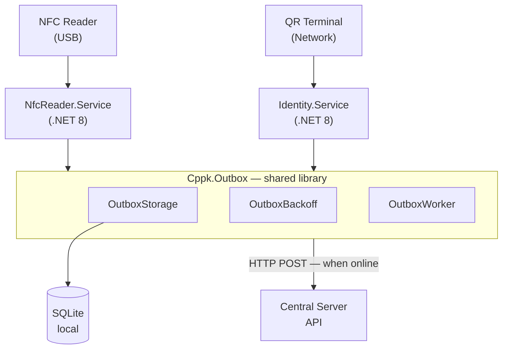

# CPPK Outbox

> **Showcase repository** — documentation only. Source code is not published due to project confidentiality.

---

# Project Overview

Offline-first event delivery system for physical access control infrastructure. Production system deployed at access control checkpoints — when network connectivity to the central server is lost, scan events (NFC card reads and QR code scans) are persisted locally and delivered automatically once connectivity is restored, preserving the original event timestamp.

Built as a shared library integrated into two Windows background services running on each checkpoint workstation in production.

**Scale:** multiple production checkpoints · zero event loss requirement

---

## Business Problem

Physical access control infrastructure at checkpoints relies on two input devices on the same workstation:

- **NFC reader (USB)** — reads employee/access cards
- **QR terminal (network)** — sends QR codes from mobile passes

Two Windows services forward scan events to a central server. **When the network fails, events were lost permanently** — creating gaps in access logs and compliance issues at production checkpoints.

Requirements for production deployment:

- Zero event loss during network outages
- Preserve **scan time** (not send time) in server records
- Automatic retry when network recovers
- Minimal changes to existing service architecture already in production
- Local persistence without external database server at the checkpoint

---

## Solution

Implementation of the **Transactional Outbox Pattern** using a local SQLite database:

1. Every scan event is **written to SQLite first** (always succeeds locally)
2. A background worker periodically attempts delivery to the central API
3. On success — record marked as sent
4. On failure — exponential backoff retry, record stays in queue
5. Server receives `FixDate` = original scan timestamp

A shared `Cppk.Outbox` library is referenced by both production services, ensuring consistent queue behavior across the access control infrastructure.

---

## Architecture

**Key components:**

| Component | Role |
|---|---|
| `OutboxStorage` | CRUD for outbox records in SQLite |
| `OutboxRecord` | Event payload + status + timestamps |
| `OutboxBackoff` | Exponential retry with configurable intervals |
| `OutboxWorker` | Background service — polls queue, sends pending records |
| `OutboxOptions` | Configurable batch size, retry limits, DB path |

---

## Technology Stack

| Layer | Technology |
|---|---|
| Language | C# |
| Runtime | .NET 8 |
| Local Storage | SQLite |
| Pattern | Transactional Outbox |
| Deployment | Windows Services |
| Integration | REST API (HTTP POST) |
| Hardware | NFC USB reader, QR network terminal |
| Logging | Serilog / structured file logging |

---

## Challenges

| Challenge | Approach |
|---|---|
| **Event loss on network failure** | Write-first to SQLite before any network call |
| **Correct timestamps in production logs** | Store `FixDate` at scan time; never overwrite on retry |
| **Duplicate delivery** | Idempotent server-side handling + status tracking in outbox |
| **Two services, one pattern** | Shared library — single implementation across checkpoint infrastructure |
| **Retry storms** | Exponential backoff with configurable max attempts |
| **Service restarts at checkpoint** | SQLite persistence survives reboots; worker resumes automatically |
| **Legacy service integration** | Minimal invasive changes — outbox wraps existing API calls |

---

## Results

- Zero event loss during tested network outage scenarios at production checkpoints
- Automatic recovery and delivery when connectivity restored
- Original scan timestamps preserved in central access control records
- Shared library deployed across multiple checkpoint workstations
- Deployed as Windows Services with standard install/uninstall flow

---

## Key Features

- Offline-first architecture — Transactional Outbox Pattern on SQLite
- Shared library for multiple Windows services at each checkpoint
- Background worker with configurable polling interval
- Exponential backoff retry for failed deliveries
- Deduplication via record status tracking (pending / sent / failed)
- Preserves original event timestamp (`FixDate`)
- SQLite schema management for outbox storage
- Structured logging for production troubleshooting
- Configurable via `appsettings.json`
- Tested with simulated network outages in production conditions

---

## Contact

[@vladimirr124](https://t.me/vladimirr124)

**Tags:** `dotnet` · `csharp` · `sqlite` · `outbox-pattern` · `windows-service` · `offline-first` · `enterprise` · `access-control`
